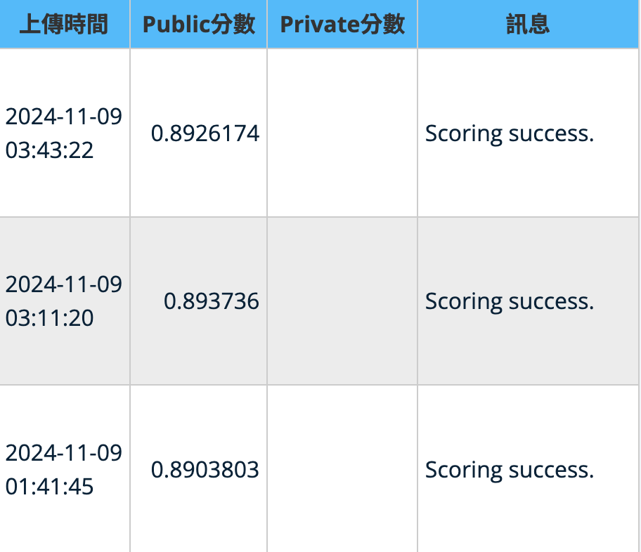

# AI CUP 2024 YuShan Artificial Intelligence Open Challenge - Application of RAG and LLM in Financial Q&A
This project is for AIcup RAG and LLM in financial Q&A contest

## How to Run the code
```
bash run.sh
```
#### run.sh
we just divide question into serveral part and execute program concurrently in different gpu devices to accelerate training time
```bash


mkdir -p "log/[Your_log_folder]"
for pid in {0..9}
do
    gpu=$((pid % [num_of_your_gpus]))
    logfile="log/log/[Your_log_folder]/$pid.log"
    nohup python multichoice.py \
        --question_path ../dataset/preliminary \
        --source_path ../reference \
        --output_path ../output \
        --pid $pid \
        --partition 10 \
        --task "[our_model]" \
        --gpu $gpu \
        > "$logfile" 2>&1 &
        #--baai_path BAAI/bge-large-zh-v1.5 \
        #--reranker BAAI/bge-reranker-v2-m3
    echo "Started process with pid=$pid, log file: $logfile"
done
```
After execute program, we need to merge every answer part into one to evaluate
```python
python output/merge.py --folder "[log folder name your save in run.sh]"
```
## Task we used
* base: read pdf without filter symmbol
* only_chinese: filter all symmbol, only remain chinese word
* pos_rank: add position score into rerank model
* baai_1.5: BAAI newest retriever model
* multilingual: newest RAG model in huggingface
* multilingual_bm25: only multilingual and bm25 to reranker

### position ranking
because we used chunk to divide context before retriever model, we noticed that in rerank model scores, there exist repeat id with different chunk score, so we add priority position score into rerank score.
## LLM model implement
### retriever
[bge-large-zh-v1.5](https://huggingface.co/BAAI/bge-large-zh)
[multilingual-e5-large](https://huggingface.co/intfloat/multilingual-e5-large)
### reranker
[bge-reranker-large](https://huggingface.co/BAAI/bge-reranker-large)
## performance
### Testing data
Precision: 0.9467 
Each category error:{'faq': 0, 'insurance': 4, 'finance': 4}

⚠️ There are 2 controversial answer in test dataset 

:::
### Contest data


